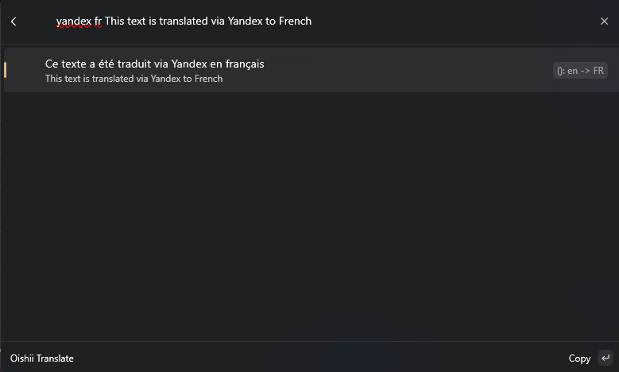
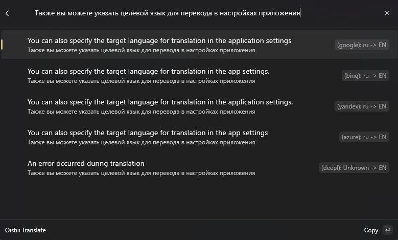
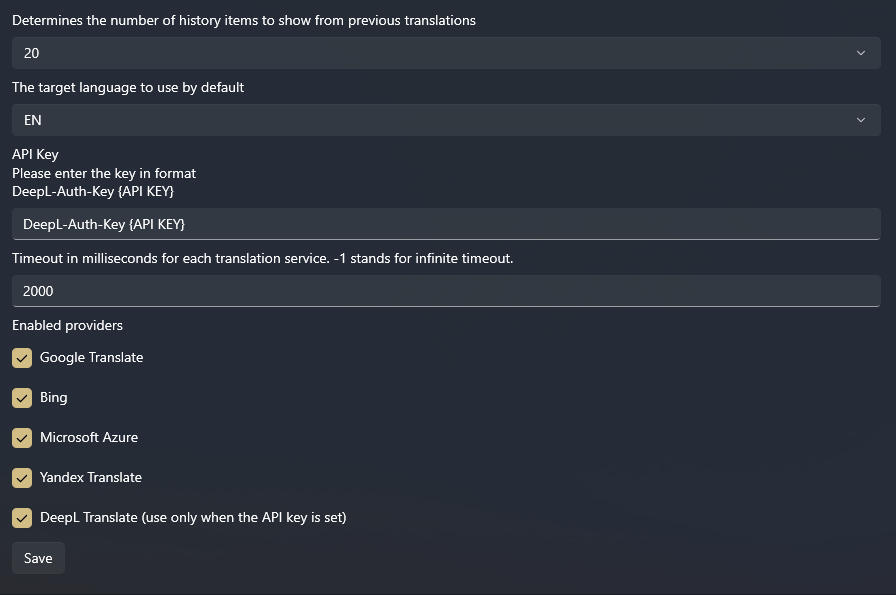

## Oishii Translate


**Oishii Translate** is a Microsoft PowerToys Command Palette extension based on the [TranslateCmdPal](https://github.com/patcher454/TranslateCmdPal) repository. It extends functionality by supporting more translation providers, including Google Translate, Bing Translate, Microsoft Azure Translate, and Yandex Translate. The DeepL translator is retained from the original repository and requires API keys, while other providers do not.


### 📥 Installation
This project is a .NET UWP app with command palette integration. While it is not published on the Microsoft Store and does not have official production releases, you can download and build a repo for personal use.

Also you can download a preview build on [releases page](https://github.com/IOExcept10n/OishiiTranslate/releases).

### 🛠️ Usage
You can request translations using the following format:
```
[provider] [language] query
```

Where `[provider]` is one of the five provider codes listed above.

### 🚀 Features
- **Multiple Translation Providers:** Supports five translation providers:
  - `google`
  - `yandex`
  - `azure`
  - `bing`
  - `deepl` (requires API key)

- **Automatic Language Recognition:** The extension automatically identifies the source language.

- **Extensive Language Support:** Translate between various languages, including:
  - Arabic (AR)
  - Bulgarian (BG)
  - Czech (CS)
  - Danish (DA)
  - German (DE)
  - Greek (EL)
  - English (EN, EN_GB, EN_US)
  - Spanish (ES)
  - Estonian (ET)
  - Finnish (FI)
  - French (FR)
  - Hungarian (HU)
  - Indonesian (ID)
  - Italian (IT)
  - Japanese (JA)
  - Korean (KO)
  - Lithuanian (LT)
  - Latvian (LV)
  - Norwegian Bokmål (NB)
  - Dutch (NL)
  - Polish (PL)
  - Portuguese (PT, PT_BR, PT_PT)
  - Romanian (RO)
  - Russian (RU)
  - Slovak (SK)
  - Slovenian (SL)
  - Swedish (SV)
  - Turkish (TR)
  - Ukrainian (UK)
  - Chinese (ZH)

### 📸 Gallery




### ⚙️ Configurability
- **Customizable Providers:** Choose which translation providers to enable.
- **Default Target Language:** Set a default language for faster results.
- **Adjustable Timeout Settings:** Configure the search timeout for queries.
- **DeepL API Key Setup:** Enter your DeepL API key for enhanced functionality.


### 📄 License
This repo is licensed under [MIT license](LICENSE).

Feel free to contribute or use this project as needed!
